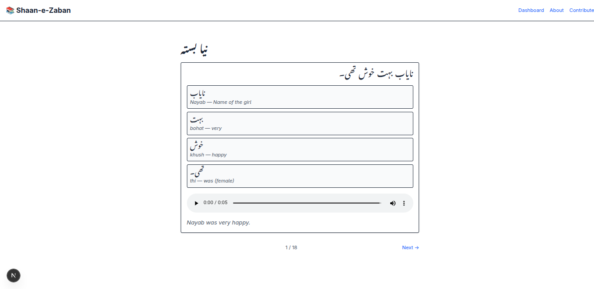

# **Shaan-e-Zaban (شانِ زبان)**


**Shaan-e-Zaban** is among the world’s first — and the only open-source, community-powered Urdu learning platform centered on immersive storytelling, human audio, and Nastaliq script.

---

## 📚 Table of Contents

* [Overview](#overview)
* [Preview](#preview)
* [Key Features](#key-features)
* [Technology Stack](#technology-stack)
* [Directory Structure](#directory-structure)
* [Installation](#installation)
* [License](#license)
* [Contribution](#contribution)

---

## 🔍 Overview

**Shaan-e-Zaban** is more than just an app — it’s a cultural movement.
Instead of vocab drills or robotic gamification, learners explore Urdu through **community-written stories** presented in authentic Urdu script.

Authors control their content:
they can optionally add **word-by-word translations**, upload **custom pronunciation audio**, and tag their stories for thematic or grammatical relevance.

### 🧠 Architecture Breakdown

* ✍️ **Story content is managed in Sanity CMS**
* 🧑‍💼 **Users and progress are stored in MongoDB via Prisma**
* 🧠 **UserProgress and StoryProgress are embedded Mongo-style**
* 📂 **Legacy stories in `/curriculum/` are used to seed Sanity at setup time**

---

## 🖼️ Preview

Here's what **Shaan-e-Zaban** looks like in action:


🌐 **Live:** [Shaan-e-Zaban](https://shaan-e-zaban.vercel.app)

---

## ✨ Key Features

* **📝 Community-Contributed Stories**
  Any signed-in user can create, edit, and delete their own stories via a full CRUD interface.

* **📚 Progressive Learning Flow**
  Stories are categorized into Beginner, Intermediate, and Advanced levels — building vocabulary and grammar naturally through context.

* **🖋 Nastaliq Script**
  Learners read in beautiful, calligraphic **Nastaliq**.

* **🔊 Optional Audio Support**
  Authors can attach `.mp3` or `.wav` recordings of their own voice or public sources for pronunciation guidance.

* **📘 Optional Word-Level Translations**
  Sentence-level English translations are required, but authors can also break down vocabulary per word.

* **🏷️ Tags for Grammar & Topics**
  Helps learners filter by themes, sentence structures, or even tenses.

* **📈 Personalized Progress Tracking**
  MongoDB-based `UserProgress` tracks favorited, completed, queued, and in-progress stories — with per-sentence resume support.

* **🔐 JWT Auth System**
  User auth and story ownership is secured via a simple custom JWT-based system.

* **🌍 Open Source & Built to Scale**
  Released under the MIT License. Scalable with Sanity, extendable with React components, and deployable anywhere.

---

## ⚙️ Technology Stack

| Layer         | Tech                                            |
| ------------- | ----------------------------------------------- |
| Frontend      | **Next.js** (App Router, React 19)              |
| Styling       | **Tailwind CSS**                                |
| Backend API   | **Next.js API Routes**                          |
| Content Layer | **Sanity CMS** (for stories, tags, media, etc.) |
| Database      | **MongoDB Atlas via Prisma** (User + Progress)  |
| Auth          | **JWT (Custom Implementation)**                 |
| Audio Storage | **Static MP3/WAV** served via `/public/audio`   |
| Deployment    | **Vercel**                                      |

---

## 📁 Directory Structure

```bash
shaan-e-zaban/
├── compose.yml                   # Docker Compose (for optional Postgres legacy use)
├── .env.example                  # Template for setting up your .env
├── .gitignore                    # Ignore unnecessary files from Git
├── LICENSE                       # MIT License file
├── README.md                     # You’re reading this
├── CONTRIBUTING.md               # Guidelines for community contributions

├── curriculum/                   # 🔹 Legacy story data used for seeding Sanity
│   ├── beginner/stories.json
│   ├── intermediate/stories.json
│   └── advanced/stories.json

└── sez/
    ├── .env.example
    ├── next.config.ts
    ├── middleware.ts
    ├── postcss.config.mjs
    ├── eslint.config.mjs
    ├── tsconfig.json
    ├── yarn.lock

    ├── prisma/                   # 🔐 MongoDB models via Prisma
    │   └── schema.prisma         # Models: User, UserProgress, StoryProgress

    ├── public/
    │   └── audio/
    │       ├── 001.mp3
    │       └── 001.wav

    ├── sanity/                   # 📦 Sanity studio
    │   ├── env.ts
    │   ├── lib/
    │   │   ├── client.ts
    │   │   ├── image.ts
    │   │   └── live.ts
    │   ├── schemaTypes/
    │   │   ├── index.ts
    │   │   ├── sentence.ts
    │   │   ├── story.ts
    │   │   └── word.ts
    │   ├── structure.ts
    │   └── scripts/
    │       └── seed.ts

    ├── src/
    │   ├── app/
    │   │   ├── layout.tsx
    │   │   ├── globals.css
    │   │   ├── page.tsx
    │   │   ├── about/page.tsx
    │   │   ├── contribute/page.tsx
    │   │   ├── dashboard/page.tsx
    │   │   ├── learn/[level]/[slug]/page.tsx
    │   │   ├── auth/
    │   │   │   ├── signin/page.tsx
    │   │   │   └── signup/page.tsx
    │   │   ├── api/
    │   │   │   ├── auth/
    │   │   │   │   ├── login/route.ts
    │   │   │   │   ├── logout/route.ts
    │   │   │   │   ├── me/route.ts
    │   │   │   │   └── signup/route.ts
    │   │   │   └── stories/
    │   │   │       ├── create/route.ts
    │   │   │       ├── delete/route.ts
    │   │   │       ├── getAll/route.ts
    │   │   │       ├── getById/route.ts
    │   │   │       └── update/route.ts
    │   ├── components/
    │   │   ├── Editor.tsx
    │   │   └── StoryCard.tsx
    │   ├── hooks/
    │   │   └── useSession.ts
    │   └── lib/
    │       ├── db.ts
    │       ├── prisma.ts
    │       ├── sanity.ts
    │       └── getServerSession.ts
```

---

## 🚀 Installation

### Prerequisites

* Node.js 20+
* Yarn (or npm / bun)
* MongoDB Atlas connection string (MONGO\_URI)
* Sanity CLI + project setup

### Setup

```bash
cd sez
yarn install
yarn dev
```

App will be running at: `http://localhost:3000`

To seed stories into Sanity from `curriculum/`, run:

```bash
yarn sanity exec sanity/scripts/seed.ts
```

---

## 📜 License

**MIT License**
© 2025 Mohammad Ali
See [`LICENSE`](./LICENSE) for full terms.

---

## 🤝 Contribution

This is your platform too — help shape its future.

Check [`CONTRIBUTING.md`](./CONTRIBUTING.md) for how to get started.

### ✨ Ways to Contribute:

* ✍️ Write authentic Urdu short stories
* 🎙 Submit voice recordings (regional accents welcome!)
* 🧠 Help improve UX, accessibility, or UI polish
* 🐞 Find & squash bugs
* 🌐 Translate the interface (coming soon)
* 🛠 Propose & build new features

Together we’ll make Urdu learning **culturally rich, script-faithful, and community-owned**.