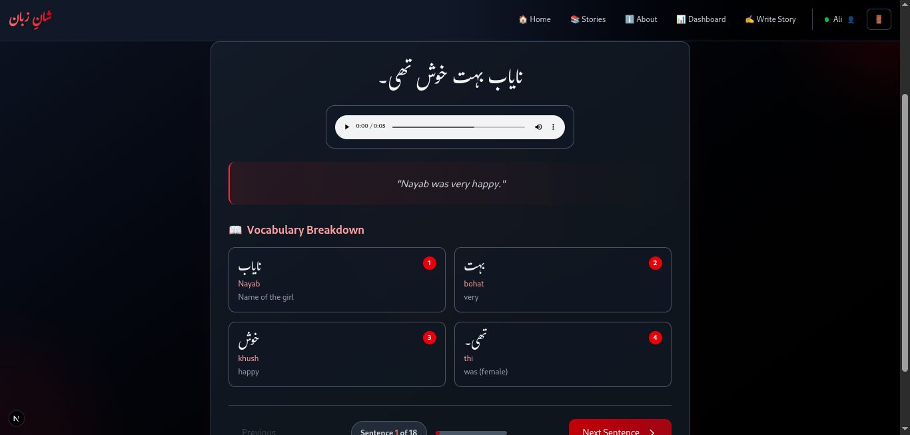

# **Shaan-e-Zaban (شانِ زبان)** 🌟


**Shaan-e-Zaban** is the world's **first open-source Urdu learning platform that teaches through immersive stories** 📚. Forget boring drills and robotic translation exercises — here, learners **experience the language**, read in **beautiful Nastaliq script**, and listen to **human audio narration**.

> **🎯 Unique Value:** Learning Urdu through stories makes language intuitive, emotional, and memorable. Every word is learned in context, not in isolation.

---

## 🖼️ Screenshots


*Immersive story reader with Nastaliq script, audio controls, and vocabulary support*

---

## 📋 Table of Contents

* [Overview](#-overview)
* [Sample Story](#-sample-story)
* [Key Features](#-key-features)
* [Technology Stack](#-technology-stack)
* [Project Structure](#-project-structure)
* [Quick Start](#-quick-start)
* [API Routes](#-api-routes)
* [License](#-license)
* [Contribution](#-contribution)

---

## 🔍 Overview

**Shaan-e-Zaban** is not just a language app — it is a **cultural and educational movement** 🌍.

Traditional language apps focus on:
* 📝 Vocab lists
* 🔁 Repetitive exercises  
* 🤖 Robotic translation

These approaches teach words, but not understanding, feeling, or context.

**Shaan-e-Zaban flips this approach**: learners explore Urdu **through community-written stories**, narrated in **authentic Nastaliq script** with **optional audio** 🎧.

---

## 🏗️ Architecture

* **🎨 Frontend Layer:** Next.js 15 with App Router, React 19, TypeScript
* **📝 Content Layer:** Sanity CMS for stories, sentences, and words
* **💾 Data Layer:** MongoDB with Prisma ORM for users and progress tracking
* **🔐 Security Layer:** Custom JWT authentication with middleware protection
* **🎵 Media Layer:** Static audio files for pronunciation guidance

---

## 📖 Sample Story

### اردو کہانی: "پہلی بس سواری" 🚌

عمران ایک طالب علم ہے۔ وہ لاہور میں رہتا ہے۔ آج وہ پہلی بار اکیلا بس کا سفر کر رہا ہے۔ اس کی امی نے کہا: "خبردار رہنا۔"

عمران بس اسٹاپ پر کھڑا ہے۔ اس کے ہاتھ میں ایک کتاب ہے۔ وہ گھبرایا ہوا ہے لیکن خوش بھی ہے۔

بس آتی ہے۔ عمران بس میں چڑھتا ہے۔ کنڈکٹر پوچھتا ہے: "کہاں جانا ہے؟"

عمران جواب دیتا ہے: "مجھے یونیورسٹی جانا ہے۔"

وہ اپنا کرایہ دیتا ہے۔ ایک سیٹ خالی ہے۔ وہ بیٹھ جاتا ہے۔

بس چلتی ہے۔ عمران کھڑکی سے باہر دیکھتا ہے۔ دکانیں، درخت، لوگ... سب کچھ نیا لگ رہا ہے۔

ایک بوڑھا آدمی بس میں چڑھتا ہے۔ تمام سیٹیں بھری ہوئی ہیں۔ عمران کھڑا ہوتا ہے اور کہتا ہے: "برائے مہربانی، آپ یہاں بیٹھیں۔"

بوڑھا آدمی مسکراتا ہے: "بہت شکریہ، بیٹا۔ تم بہت اچھے ہو۔"

عمران خوش ہوتا ہے۔ وہ پہلی بار اکیلا سفر کر رہا ہے لیکن سب کچھ ٹھیک ہے۔

### 📚 Vocabulary (لفظوں کا ذخیرہ)

| English | Urdu | Example Sentence |
|---------|------|-----------------|
| Student | طالب علم | عمران ایک طالب علم ہے |
| Alone | اکیلا | وہ اکیلا سفر کر رہا ہے |
| Bus | بس | بس آتی ہے |
| Journey | سفر | بس کا سفر |
| Caution | خبردار | خبردار رہنا |
| Conductor | کنڈکٹر | کنڈکٹر نے پوچھا |
| Fare | کرایہ | اس نے کرایہ دیا |
| Seat | سیٹ | سیٹ خالی ہے |
| University | یونیورسٹی | یونیورسٹی جانا ہے |
| Old man | بوڑھا آدمی | بوڑھا آدمی مسکراتا ہے |
| Please | برائے مہربانی | برائے مہربانی بیٹھیں |
| Thank you | شکریہ | آپ کا شکریہ |
| Happy | خوش | وہ خوش ہوتا ہے |

> *This sample demonstrates **how stories make learning natural, memorable, and fun**.*

---

## ✨ Key Features

* **📝 Community-Contributed Stories** – Full CRUD for signed-in users
* **📚 Progressive Learning Flow** – Beginner → Intermediate → Advanced stories
* **🖋 Nastaliq Script** – Elegant calligraphy for authentic reading experience
* **🔊 Audio Support** – MP3/WAV for pronunciation guidance
* **📘 Word & Sentence Translations** – Comprehensive learning support
* **🏷️ Grammar & Topic Tags** – Filter stories by theme and difficulty
* **📈 Progress Tracking** – MongoDB-based progress tracking with favorites and ratings
* **🔐 JWT Auth System** – Secure authentication & story ownership
* **🌍 Open Source** – MIT licensed and community driven

---

## ⚙️ Technology Stack

| Layer | Technology |
|-------|------------|
| 🎨 Frontend | Next.js 15, React 19, TypeScript |
| 🎨 Styling | Tailwind CSS |
| 🔧 Backend | Next.js API Routes |
| 📝 Content | Sanity CMS |
| 🗄️ Database | MongoDB with Prisma ORM |
| 🔐 Authentication | JWT with custom middleware |
| 🔊 Audio | Static MP3/WAV files |
| 🛠️ Development | ESLint, PostCSS |

---

## 📁 Project Structure (Production Grade)

```
Shaan-e-Zaban/
├── 📚 curriculum/                 # Legacy story data
│   ├── beginner/stories.json
│   ├── intermediate/stories.json
│   └── advanced/stories.json
├── 📄 LICENSE
├── 📖 README.md
├── 🤝 CONTRIBUTING.md
├── 🖼️ screenshots/
└── 🌐 web/                        # Next.js 15 Application
    ├── 🛠️ next.config.ts          # Next.js configuration
    ├── 🛡️ middleware.ts           # Authentication & security
    ├── ⚙️ package.json
    ├── 🗄️ prisma/schema.prisma    # MongoDB schema
    ├── 🔊 public/audio/           # Audio assets (001.mp3, 001.wav)
    ├── 📝 sanity/                 # Sanity CMS configuration
    │   ├── schemaTypes/           # Story, Sentence, Word schemas
    │   ├── lib/client.ts          # Sanity client
    │   └── scripts/seed.ts        # Data seeding
    └── 🎯 src/
        ├── 🏠 app/                # Next.js 15 App Router
        │   ├── 🎯 api/            # API routes
        │   │   ├── 🔐 auth/       # Authentication endpoints
        │   │   │   ├── login/route.ts
        │   │   │   ├── logout/route.ts
        │   │   │   ├── me/route.ts
        │   │   │   └── signup/route.ts
        │   │   ├── 📊 progress/   # Progress tracking
        │   │   │   ├── complete/route.ts
        │   │   │   ├── favorite/route.ts
        │   │   │   ├── preferences/route.ts
        │   │   │   ├── rate/route.ts
        │   │   │   ├── session/route.ts
        │   │   │   └── stats/route.ts
        │   │   ├── 📚 stories/    # Story management
        │   │   │   ├── [id]/route.ts
        │   │   │   └── route.ts
        │   │   └── 🩺 health/route.ts
        │   ├── 🔐 auth/           # Authentication pages
        │   │   ├── signin/page.tsx
        │   │   └── signup/page.tsx
        │   ├── (pages)/           # Route groups for organization
        │   │   ├── 📚 learn/[level]/[slug]/  # Learning interface
        │   │   ├── ✍️ contribute/             # Story contribution
        │   │   ├── 📊 dashboard/              # User dashboard
        │   │   ├── 🛠️ edit/[slug]/           # Story editing
        │   │   ├── 📖 stories/               # Story browsing
        │   │   └── ℹ️ about/                 # About page
        │   └── layout.tsx         # Root layout
        ├── 🧩 components/         # React components
        │   ├── 🏗️ layout/        # Layout components (Navbar)
        │   ├── ⚡ features/       # Feature components
        │   │   ├── 🔐 auth/AuthInitializer.tsx
        │   │   ├── 📊 progress/   # Progress tracking components
        │   │   └── 📚 stories/   # Story-related components
        │   └── index.ts           # Barrel exports
        ├── 🎣 hooks/              # Custom React hooks
        ├── 🛠️ lib/               # Utilities & configurations
        │   ├── 🔐 auth/           # Authentication utilities
        │   ├── 🗄️ database/      # MongoDB with Prisma
        │   ├── 📝 cms/           # Sanity CMS client
        │   ├── 📁 types/         # TypeScript definitions
        │   ├── 🛠️ utils/         # Helper functions
        │   └── index.ts           # Centralized exports
        └── 🗂️ stores/            # State management (authStore.ts)
```

---

## 🚀 Quick Start

### Prerequisites

* Node.js LTS (18+)
* MongoDB database (local or Atlas)
* Sanity.io account

### Installation

```bash
# Clone the repository
git clone https://github.com/Mohammad-Ali-Rauf/shaan-e-zaban.git
cd shaan-e-zaban/web

# Install dependencies
yarn install

# Set up environment variables
cp .env.example .env
```

Edit `.env` with your credentials:

```env
# Database
DATABASE_URL="mongodb://localhost:27017/shaan-e-zaban"

# Authentication
JWT_SECRET="your-super-secret-jwt-token"

# Sanity CMS
SANITY_PROJECT_ID="your-project-id"
SANITY_DATASET="production"
SANITY_API_WRITE_TOKEN="your-write-token"
```

```bash
# Set up database
npx prisma generate
npx prisma db push

# Start development server
yarn dev
```

App runs at: `http://localhost:3000`

### Available Scripts

```bash
yarn dev          # Start development server
yarn build        # Build for production
yarn start        # Start production server
yarn lint         # Run ESLint
```

---

## 🎯 API Routes

| Endpoint | Method | Description | Auth Required |
|----------|--------|-------------|---------------|
| `/api/auth/login` | POST | User login | No |
| `/api/auth/signup` | POST | User registration | No |
| `/api/auth/me` | GET | Get current user | Yes |
| `/api/auth/logout` | POST | User logout | Yes |
| `/api/stories` | GET | List stories | No |
| `/api/stories/[id]` | GET | Get story details | No |
| `/api/progress/complete` | POST | Mark story as complete | Yes |
| `/api/progress/favorite` | POST | Toggle story favorite | Yes |
| `/api/progress/rate` | POST | Rate a story | Yes |
| `/api/progress/stats` | GET | Get user progress stats | Yes |

---

## 📜 License

**MIT License** © 2025 Mohammad Ali  
See [`LICENSE`](./LICENSE) for full terms.

---

## 🤝 Contribution

This is your platform too — help shape its future! 🚀

Check [`CONTRIBUTING.md`](./CONTRIBUTING.md) for guidelines.

### Ways to Contribute

* ✍️ Write authentic Urdu short stories
* 🎙 Submit voice recordings (regional accents welcome)
* 🧠 Improve UX, accessibility, or UI polish
* 🐞 Report or fix bugs
* 🌐 Translate interface (coming soon)
* 🛠 Propose and build new features

> **🌟 Your stories can make learning Urdu alive for thousands of learners.**

---

<div align="center">

**Made with ❤️ for the Urdu language and its learners worldwide**

</div>

---